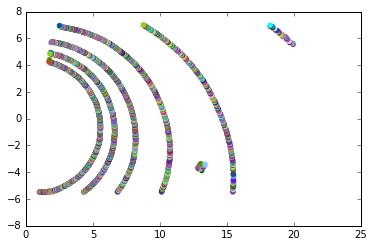
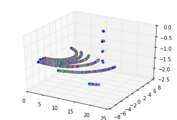
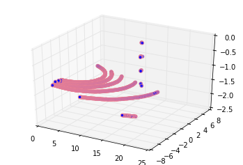

---
redirect_from:
  - "/features/pypcd"
interact_link: content/features/pypcd.ipynb
title: 'PyPCD (Python)'
prev_page:
  url: /features/open3d
  title: 'Open3D (Python)'
next_page:
  url: /guide/01_overview
  title: '환경구성'
comment: "***PROGRAMMATICALLY GENERATED, DO NOT EDIT. SEE ORIGINAL FILES IN /content***"
---

## PyPCD
- 본 챕터에서는 [pypcd](https://github.com/dimatura/pypcd)의 기본적인 파일 입력, Numpy변환, 저장 방법에 대하여 정리 하였습니다. 

- pypcd는 **Point Cloud Library**에 기반한 PCD파일 읽기/쓰기가 가능한 Pure Python module 입니다. 
- 특징으로는 ROS 메시지 전송을 지원 합니다. 

> [PCL-To-All Docker](https://hub.docker.com/r/adioshun/pcl_to_all/)에는 설치 되어 있지 않습니다.


{:.input_area}
```python
%load_ext watermark
%watermark -d -v -p pypcd
```


{:.output_stream}
```
2018-11-23 

CPython 2.7.12
IPython 5.8.0

pypcd 0.1.1

```


{:.input_area}
```python
import sys
!{sys.executable} -m pip install --user pypcd
```


{:.output_stream}
```
Requirement already satisfied: pypcd in /usr/local/lib/python2.7/dist-packages
Requirement already satisfied: python-lzf in /usr/local/lib/python2.7/dist-packages (from pypcd)
Requirement already satisfied: numpy in /usr/local/lib/python2.7/dist-packages (from pypcd)
You are using pip version 9.0.1, however version 18.1 is available.
You should consider upgrading via the 'pip install --upgrade pip' command.

```


{:.input_area}
```python
import pypcd
import numpy as np

import os
os.chdir("/workspace/3D_People_Detection_Tracking") 
```


{:.input_area}
```python
cloud = pypcd.PointCloud.from_path('./sample/lobby.pcd')
```


{:.output_traceback_line}
```
---------------------------------------------------------------------------
```

{:.output_traceback_line}
```
ValueError                                Traceback (most recent call last)
```

{:.output_traceback_line}
```
<ipython-input-2-94c291a77ae6> in <module>()
----> 1 cloud = pypcd.PointCloud.from_path('./sample/lobby.pcd')

```

{:.output_traceback_line}
```
/usr/local/lib/python2.7/dist-packages/pypcd/pypcd.pyc in from_path(fname)
    733     @staticmethod
    734     def from_path(fname):
--> 735         return point_cloud_from_path(fname)
    736 
    737     @staticmethod

```

{:.output_traceback_line}
```
/usr/local/lib/python2.7/dist-packages/pypcd/pypcd.pyc in point_cloud_from_path(fname)
    300     """
    301     with open(fname, 'rb') as f:
--> 302         pc = point_cloud_from_fileobj(f)
    303     return pc
    304 

```

{:.output_traceback_line}
```
/usr/local/lib/python2.7/dist-packages/pypcd/pypcd.pyc in point_cloud_from_fileobj(f)
    282         if ln.startswith('DATA'):
    283             metadata = parse_header(header)
--> 284             dtype = _build_dtype(metadata)
    285             break
    286     if metadata['data'] == 'ascii':

```

{:.output_traceback_line}
```
/usr/local/lib/python2.7/dist-packages/pypcd/pypcd.pyc in _build_dtype(metadata)
    208             fieldnames.extend(['%s_%04d' % (f, i) for i in xrange(c)])
    209             typenames.extend([np_type]*c)
--> 210     dtype = np.dtype(zip(fieldnames, typenames))
    211     return dtype
    212 

```

{:.output_traceback_line}
```
ValueError: field '__0000' occurs more than once
```


{:.input_area}
```python
./sample/lobby.pcd
```


{:.output_stream}
```
/workspace/3D_People_Detection_Tracking

```


{:.input_area}
```python
cloud.get_metadata()
```


{:.output_data_text}
```
{'count': [1, 1, 1, 1],
 'data': 'ascii',
 'fields': ['x', 'y', 'z', 'rgb'],
 'height': 1,
 'points': 2750,
 'size': [4, 4, 4, 4],
 'type': ['F', 'F', 'F', 'F'],
 'version': '0.7',
 'viewpoint': [0.0, 0.0, 0.0, 1.0, 0.0, 0.0, 0.0],
 'width': 2750}
```


{:.input_area}
```python
print(cloud.pc_data['rgb'])
```


{:.output_stream}
```
[ 0.  0.  0. ...,  0.  0.  0.]

```

## array로 변경


{:.input_area}
```python
new_cloud_data = cloud.pc_data.copy()
```


{:.input_area}
```python
# we need numpy now
import numpy as np

# convert the structured numpy array to a ndarray
new_cloud_data = cloud.pc_data.view(np.float32).reshape(cloud.pc_data.shape + (-1,))
```


{:.input_area}
```python
new_cloud_data.shape[0]
```


{:.output_data_text}
```
2750
```


{:.input_area}
```python
new_cloud_data
```


{:.output_data_text}
```
array([[  1.00166738,   5.48460579,  -1.49390364,   0.        ],
       [  1.01868272,   5.46968126,  -1.49079776,   0.        ],
       [  1.03777063,   5.46609163,  -1.49079776,   0.        ],
       ..., 
       [ 18.39475441,  -6.8848362 ,  -1.71836269,   0.        ],
       [ 18.24389076,  -6.90107012,  -1.70650947,   0.        ],
       [ 18.23457718,  -6.97040224,  -1.70790386,   0.        ]], dtype=float32)
```


{:.input_area}
```python
import sys
sys.path.append("/workspace/include")
import pcl_helper

n_random_color = 20
random_color = np.zeros(n_random_color,float)
for i in range(0,new_cloud_data.shape[0]):
    #labbels[0]
    new_cloud_data[i,3:4] = pcl_helper.rgb_to_float(pcl_helper.random_color_gen())
    

```


{:.input_area}
```python
new_cloud_data[:,0:3]
```


{:.output_data_text}
```
array([[  1.00166738,   5.48460579,  -1.49390364],
       [  1.01868272,   5.46968126,  -1.49079776],
       [  1.03777063,   5.46609163,  -1.49079776],
       ..., 
       [ 18.39475441,  -6.8848362 ,  -1.71836269],
       [ 18.24389076,  -6.90107012,  -1.70650947],
       [ 18.23457718,  -6.97040224,  -1.70790386]], dtype=float32)
```


{:.input_area}
```python
new_cloud_data
```


{:.output_data_text}
```
array([[  1.00166738e+00,   5.48460579e+00,  -1.49390364e+00,
          1.91391502e-38],
       [  1.01868272e+00,   5.46968126e+00,  -1.49079776e+00,
          2.06848245e-38],
       [  1.03777063e+00,   5.46609163e+00,  -1.49079776e+00,
          6.83871486e-39],
       ..., 
       [  1.83947544e+01,  -6.88483620e+00,  -1.71836269e+00,
          5.10465005e-40],
       [  1.82438908e+01,  -6.90107012e+00,  -1.70650947e+00,
          2.31961699e-39],
       [  1.82345772e+01,  -6.97040224e+00,  -1.70790386e+00,
          1.92780974e-39]], dtype=float32)
```


## After decode Tool


{:.input_area}
```python
%matplotlib inline

# Now visualize the points with matplotlib
import matplotlib.pyplot as plt
```


{:.input_area}
```python
# split the rgb column into three columns: red, green and blue
rgb_columns = pypcd.decode_rgb_from_pcl(cloud.pc_data['rgb'])

# normalize the rgb values (they should be between [0, 1])
rgb_columns = (rgb_columns / 255.0).astype(np.float)
```


{:.input_area}
```python
# Plot again with color
plt.scatter(new_cloud_data[:, [0]], -new_cloud_data[:, [1]], color=rgb_columns)
plt.axis('scaled');
```





{:.input_area}
```python
from mpl_toolkits.mplot3d import Axes3D

# Create a figure with a subplot with three axes
fig = plt.figure()
ax = fig.add_subplot(111, projection='3d')

ax.scatter(new_cloud_data[:,0], new_cloud_data[:,1], new_cloud_data[:,2], color=rgb_columns);
```





{:.input_area}
```python
type(rgb_columns)
```


{:.output_data_text}
```
numpy.ndarray
```


{:.input_area}
```python
rgb_columns.shape
```


{:.output_data_text}
```
(2750, 3)
```


{:.input_area}
```python
rgb_columns.dtype
```


{:.output_data_text}
```
dtype('float64')
```


{:.input_area}
```python
rgb_columns
```


{:.output_data_text}
```
array([[ 0.81568627,  0.40784314,  0.16470588],
       [ 0.88235294,  0.23529412,  0.87843137],
       [ 0.29019608,  0.46666667,  0.55686275],
       ..., 
       [ 0.01960784,  0.55686275,  0.97254902],
       [ 0.09803922,  0.25882353,  0.14901961],
       [ 0.07843137,  0.99215686,  0.95294118]])
```


# without decode Tool


{:.input_area}
```python
rgb_columns1 = np.asarray(pcl_helper.random_color_gen())

```


{:.input_area}
```python
type(rgb_columns1)
```


{:.output_data_text}
```
numpy.ndarray
```


{:.input_area}
```python
rgb_columns1 = (rgb_columns1 / 255.0).astype(np.float)
```


{:.input_area}
```python
from mpl_toolkits.mplot3d import Axes3D

# Create a figure with a subplot with three axes
fig = plt.figure()
ax = fig.add_subplot(111, projection='3d')

ax.scatter(new_cloud_data[:,0], new_cloud_data[:,1], new_cloud_data[:,2], color=rgb_columns1);
```





{:.input_area}
```python
new_cloud_data[:,0]
```


{:.output_data_text}
```
array([  1.00166738,   1.01868272,   1.03777063, ...,  18.39475441,
        18.24389076,  18.23457718], dtype=float32)
```


{:.input_area}
```python
rgb_columns
```


{:.output_data_text}
```
array([[ 0.81568627,  0.40784314,  0.16470588],
       [ 0.88235294,  0.23529412,  0.87843137],
       [ 0.29019608,  0.46666667,  0.55686275],
       ..., 
       [ 0.01960784,  0.55686275,  0.97254902],
       [ 0.09803922,  0.25882353,  0.14901961],
       [ 0.07843137,  0.99215686,  0.95294118]])
```


{:.input_area}
```python
# And print some sample form the rgb column
print(new_cloud_data[:100, [3]]).reshape(1, -1)
```


{:.output_stream}
```
[[  1.91391502e-38   2.06848245e-38   6.83871486e-39   1.80425767e-38
    2.00014266e-38   2.20729788e-38   1.46291790e-38   1.87544321e-38
    7.10961388e-39   5.17087962e-39   1.88927753e-38   8.62621118e-39
    1.74704910e-38   8.19271249e-39   1.48454610e-38   2.20485345e-38
    6.35897192e-39   3.21686980e-39   1.27655263e-38   1.59758577e-38
    2.24054873e-39   2.12435880e-38   9.59862263e-39   1.64438717e-38
    2.14944611e-39   2.20090781e-38   1.72197553e-38   1.82830199e-38
    1.33351051e-38   1.54079913e-39   1.32759885e-38   1.71286190e-38
    8.82327438e-39   1.80263455e-39   2.21174868e-38   1.66724557e-38
    1.54759823e-39   1.31544511e-38   1.47332997e-38   2.08111109e-38
    2.03578525e-38   2.20660633e-38   1.09654996e-38   1.43230289e-38
    1.60405935e-39   1.42220444e-38   1.13297994e-38   1.36603143e-38
    2.30696046e-38   9.44780228e-39   1.64677541e-38   1.88774325e-38
    2.19971461e-38   5.13602792e-39   9.96597582e-39   8.00565316e-39
    4.61137057e-39   3.29052905e-41   2.21679882e-38   1.32062487e-38
    6.86011268e-39   2.01598350e-38   6.88236811e-39   1.77541306e-38
    1.75465619e-38   2.22309836e-38   1.17961473e-38   2.32099615e-38
    5.39106704e-39   4.45478387e-40   2.77276188e-39   1.46311408e-38
    2.36616252e-39   1.48855816e-38   2.09603001e-38   2.00806715e-38
    1.00414680e-38   1.57212025e-38   2.14299103e-38   1.02275408e-38
    1.99090320e-39   3.09113409e-39   7.85733553e-39   1.48913606e-38
    1.15186664e-38   1.34572297e-39   1.20232179e-38   1.62091893e-38
    6.66108486e-39   1.89147771e-38   2.08793625e-38   2.33037854e-38
    1.30877213e-38   2.35087842e-38   2.24140632e-38   5.56645216e-39
    3.06441553e-40   1.48294372e-38   8.36631235e-40   3.40540750e-39]]

```

## 2D 시각화
