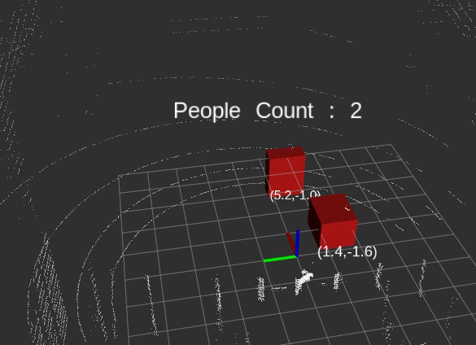
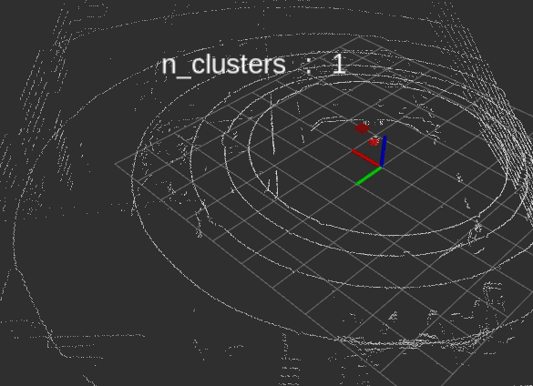

---
redirect_from:
  - "/intro"
  - "/"
title: 'Home'
prev_page:
  url: 
  title: ''
next_page:
  url: /features/intro_pcl
  title: 'PCL'
comment: "***PROGRAMMATICALLY GENERATED, DO NOT EDIT. SEE ORIGINAL FILES IN /content***"
---
# PCL 정리 노트

그동안 살펴 보았던 PCL 사용 및 활용에 대하여 정리 하고자 합니다.

PCL은 `Point cloud Library`의 약어로 Lidar나 RGB-D센서 등으로 수집되는 점군(Point cloud)를 처리 하기 위한 라이브러리 입니다.

Point cloud를 처리를 위한 라이브러리로는 PCL, PCL-python, Open3D, pyPCD, Laspy, PCLpy 등이 있습니다.

여기서는 PCL-Python과 일부 Open3D를 활용합니다.

## Environment

- 언어: python2
- 라이브러리 : PCL-Python (PCL의 python버젼인)
- OS : Ubuntu 16.4 with ROS
- 센서 : Velodyne Puck (16ch Lidar)

## Mini Project

진행은 Lidar로 수집되는 점군 데이터에서 사람을 추출 하는 3D People Detection 구현을 목표로 하고 있습니다.

|||
|-|-|
|[초급] People Detection|[중급] People Detection and Tracking|

[초급] People Detection
- 대상 환경 : 사람외 사물이 없는 공간(eg. 로비)
- 주요 기술 : 필터링, 바닥제거, 노이즈제거, 클러스터링

[중급] People Detection and Tracking
- 대상 환경 : 사람과 사물이 공존하는 공간(eg. 사무실)
- 주요 기술 : 초급 기술 + 배경제거, 추적

[고급] People Detection and Tracking with Deeplearning
- End-to-End (딥러닝 으로 가능할까??)

## Plan

|            | 초급                | 중급                   | 고급               |
|:----------:|---------------------|------------------------|--------------------|
| 2018.11.22 | 0.1 ~~Home/PCL~~    |                        |                    |
| 2018.11.22 | 0.2 환경구축        |                        |                    |
| 2018.11.23 | 1.1 Down Sampling   |                        |                    |
| 2018.11.23 | 1.2 ROI Filtering   |                        |                    |
| 2018.11.29 | 1.3 Noise Filtering |                        |                    |
| 2018.11.29 | 1.4 Plane Removal   |                        |                    |
| 2018.11.30 | 1.5 Clustering      |                        |                    |
| 2018.12.03 |                     | 2.1 Background Removal |                    |
| 2018.12.04 |                     | 2.2 Clustering         |                    |
| 2018.12.05 |                     | 2.3 Tracking           |                    |
| 2019.03.01 |                     |                        | 3.1 Clustering     |
| 2019.04.01 |                     |                        | 3.2 Classification |
| 2019.05.01 |                     |                        | 3.3 Tracking       |
