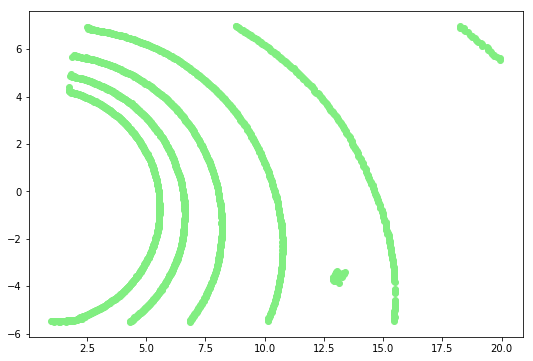
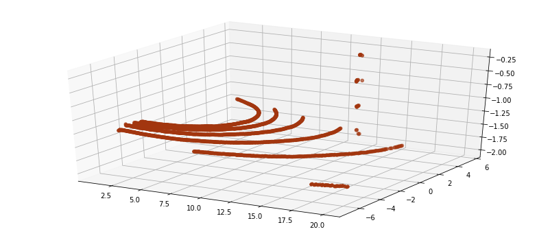

---
redirect_from:
  - "/visualization/viz-jupyter"
interact_link: content/visualization/viz_jupyter.ipynb
title: 'Jupyter 기반'
prev_page:
  url: /visualization/intro_visualization
  title: '시각화'
next_page:
  url: /references/references
  title: 'References'
comment: "***PROGRAMMATICALLY GENERATED, DO NOT EDIT. SEE ORIGINAL FILES IN /content***"
---

## Jupyter에서 Point cloud를 시각화

- Matplotlib 기반 시각화
- k3d 기반 시각화

> 코드는 [[여기에]](https://github.com/hunjung-lim/3D_People_Detection_Tracking/tree/master/include/visualization_helper.py)에 올려 두었습니다. 


{:.input_area}
```python
# -*- coding: utf-8 -*-
from __future__ import print_function

import os
os.chdir("/workspace/3D_People_Detection_Tracking") 
from include.visualization_helper import *

%matplotlib inline
```


{:.input_area}
```python
import pcl
pc = pcl.load("/workspace/_pcd/test_pypcd_xyzrgb.pcd")  
pc_arr = pc.to_array()
```


## Matplotlib 기반 시각화


{:.input_area}
```python
visualization2D_xyz(pc_arr)
```


{:.output_stream}
```
(x) : 18.9m
(y) : 12.5m
(z) : 1.8m

```





{:.input_area}
```python
visualization3D_xyz(pc_arr)
```


{:.output_stream}
```
(x) : 18.9m
(y) : 12.5m
(z) : 1.8m

```





## k3d 기반 시각화

설치 및 Jupyter 설정이 필요 합니다. [[참고]](https://github.com/K3D-tools/K3D-jupyter)

배포하는 [Docker](https://hub.docker.com/r/adioshun/pcl_to_all/)에는 설정이 되어 있으니 바로 실행 하면 됩니다. 


{:.input_area}
```python
visualization_inter3D_xyz(pc_arr) # import k3d
```


{:.output_stream}
```
2750

```


{:.output_data_text}
```
Output()
```


{:.output_stream}
```
(x) : 18.9m
(y) : 12.5m
(z) : 1.8m

```
