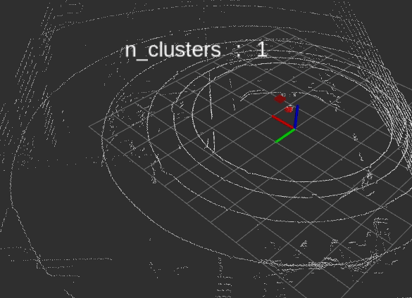

# PCL 정리 노트

이곳에서는 그동안 익혔던 PCL 사용 및 활용에 대하여 정리 하고자 합니다.

PCL은 `Point cloud Library`의 약어로 Lidar나 RGB-D센서 등으로 수집되는 점군(Point cloud)를 처리 하기 위한 라이브러리 입니다.

Point cloud를 처리를 위한 라이브러리는 여러 종류가 있습니다.

- PCL
- PCL-python
- Open3D
- pyPCD, Laspy, PCLpy, etc.

> 여기서는 PCL-Python과 일부 Open3D를 활용합니다. 

## Environment

- 언어: python2
- 라이브러리 : PCL-Python (PCL의 python버젼인)
- OS : Ubuntu 16.4 with (Optional) ROS
- 센서 : Velodyne Puck (16ch Lidar)

## Mini Project

진행은 Lidar로 수집되는 점군 데이터에서 사람을 추출 하는 3D People Detection 구현을 목표로 하고 있습니다.

### [초급] People Detection

- 대상 환경 : 사람외 사물이 없는 공간(eg. 로비)

- 주요 기술 : 필터링, 바닥제거, 노이즈제거, 클러스터링

  - 1.1 Down Sampling : Voxelization,
  - 1.2 RoI Filtering : passthrough filter, conditional filter
  - 1.3 Noise Filtering : Statistical filtering, Radius Filtering
  - 1.4 Plane Removal : RANSAC segmentation
  - 1.5 Clustering

### [중급] People Detection and Tracking

- 대상 환경 : 사람과 사물이 공존하는 공간(eg. 사무실)
- 주요 기술 : 초급 기술 + 배경제거, 추적

  - 2.1 Background Removal :  Octree based
  - 2.2 Clustering
  - 2.3 Tracking

### [고급] People Detection and Tracking with Deeplearning
- End-to-End (딥러닝 으로 가능할까??)

## Plan

|            | 초급                | 중급                   | 고급               |
|:----------:|:---------------------|:------------------------|:--------------------|
| 2018.11.22 | 0.2 환경구축        |                        |                    |
| 2018.11.22 | 0.1.1 PCL(Python)   |                        |                    |
| 2018.11.23 | 1.1 Down Sampling   |                        |                    |
| 2018.11.23 | 1.2 ROI Filtering   |                        |                    |
| 2018.11.29 | 1.3 Noise Filtering |                        |                    |
| 2018.11.29 | 1.4 Plane Removal   |                        |                    |
| 2018.11.30 | 1.5 Clustering      |                        |                    |
| 2018.12.03 |                     | 2.1 Background Removal |                    |
| 2018.12.04 |                     | 2.2 Clustering         |                    |
| 2018.12.05 |                     | 2.3 Tracking           |                    |
| 2019.03.01 |                     |                        | 3.1 Clustering     |
| 2019.04.01 |                     |                        | 3.2 Classification |
| 2019.05.01 |                     |                        | 3.3 Tracking       |

> Clustering, Tracking, Classification은 PCL보다는 AI쪽 기술이어서 포함 할지 고민중입니다.

## References

정리 내용은 기본적으로는 [PCL홈페이지](http://www.pointclouds.org)의 Documentation-[Tutorial](http://www.pointclouds.org/documentation/tutorials/)에 있는 내용을 기반으로 하고 있습니다.

부분적으로 PCL홈페이지의 [Media](http://www.pointclouds.org/media/)에 있는 각 컨퍼런스 발표 자료를 참고 하였습니다.

부분적으로 [라온피플 블로그](https://blog.naver.com/PostList.nhn?blogId=laonple&from=postList&categoryNo=41#) 자료를 참고 하고 있습니다.

부분적으로 [PCL/OpenNI](http://robotica.unileon.es/index.php/PhD-3D-Object-Tracking) 자료를 참고 하고 있습니다.
- PCL/OpenNI tutorial 2: Cloud processing (basic)
- PCL/OpenNI tutorial 3: Cloud processing (advanced)

부분적으로 [3D Perception](https://github.com/fouliex/RoboticPerception)의 코드를 참고 하고 있습니다.
- def do_voxel_grid_downssampling(pcl_data,leaf_size):
- def do_statistical_outlier_filtering(pcl_data,mean_k,tresh):
- def do_passthrough(pcl_data,filter_axis,axis_min,axis_max):

추가적으로 cpp기반 Sample Code 및 Tutorial을 보려면 [[이곳]](https://github.com/UnaNancyOwen/Tutorials)을 추천 합니다.

## Acknowledgements

Chris Holdgraf의 [Books with Jupyter and Jekyll](https://predictablynoisy.com/jupyter-book/intro.html)을 활용하여 구성 하였습니다.

김성훈 교수님의 [모두를 위한 딥러닝 강의](https://hunkim.github.io/ml/)에 고마움을 느껴 정리 하게 되었습니다.
